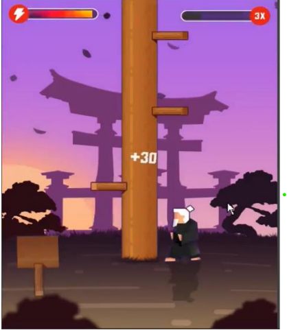
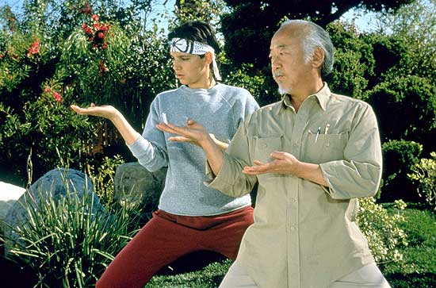

# Karate Kido Automation
Computer_Vision 
---

Welcome to the **Karate Kido Automation** project! 🚀 This project is all about combining **computer vision** 🖥️👁️ and **real-time interactions** ⏱️ to automate a fast-paced and exciting game: **Karate Kido**! 🥳
-
---

**Karate Kido** is a game where a Karate master chops a tree into wooden pieces 🪓🌲 while dodging dangerous branches 🌿. Quick reflexes 🏃‍♂️ and sharp focus 🧠 are key to reaching higher levels! The gameplay includes:
1. **Player Goal**: Chop the tree by selecting the correct side (left or right) of the screen! 👈👉  
2. **Challenge**: Avoid branches, break glass panels, and collect glowing lanterns as you progress! ✨💡  
3. **Levels**: From basic wood chopping to handling dynamic obstacles and scoring bonuses! 💪🔥  
Play the game here: [Karate Kido](https://prizes.gamee.com/game/karatekid2).
---

Our mission is to **automate the game** with a computer-powered Karate Kid who can:
- ⏱️ Recognize the game window in real-time.  
- 🤔 Analyze the tree and decide the right move.  
- 🎯 Execute precise actions to dodge branches, shatter glass, and collect lanterns.  
- 🚀 Adapt to changing difficulty levels and challenges as the game progresses.
---
-

1. **Real-Time Input**: Detect live game frames to identify challenges dynamically! 🎥🕶️  
2. **Action Decisions**: Smartly choose the correct side of the screen for chopping. 🪓🧠  
3. **Level-Specific Logic**:  
   - 🪵 Chop wood accurately.  
   - 🔢 Handle challenges like numbered strikes and glass obstacles.  
   - 💡 Collect lanterns to boost gameplay!  
4. **Fast Response**: Ensure lightning-speed reactions to match the game’s pace! ⚡🎮  
---

1. **👁️ Computer Vision**:  
   - Extract game visuals in real-time.  
   - Use image processing to identify game objects and challenges.  
2. **🤔 Smart Logic**:  
   - Decide moves using Python-based algorithms. 🐍💻  
   - Avoid branches and react to specific obstacles dynamically.  
3. **🚀 Execution**:  
   - Simulate player actions with automated inputs (left/right screen clicks or keyboard). 👈👉⌨️  
---
